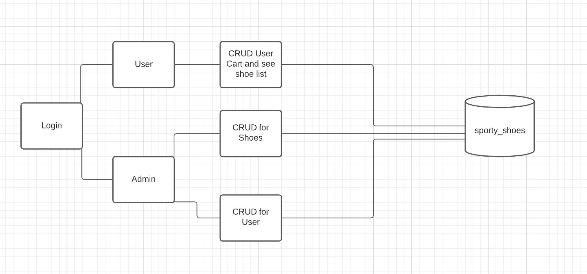
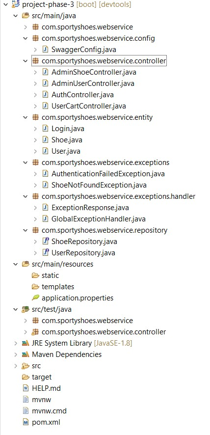
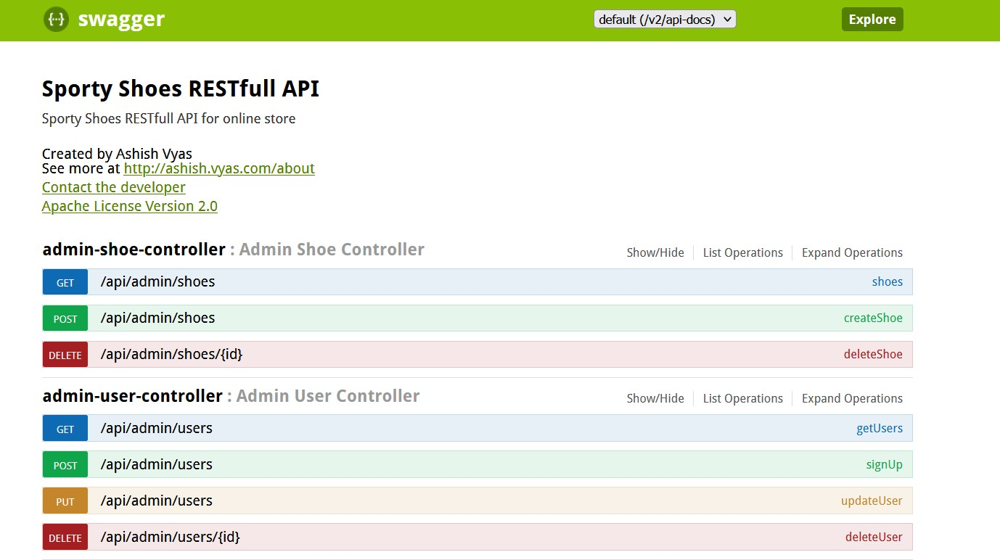
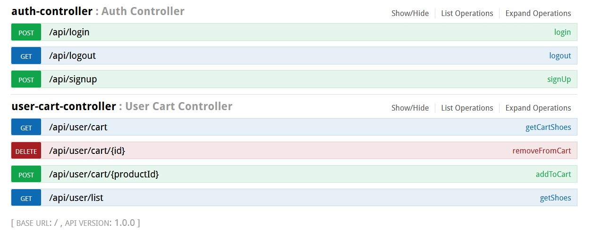

->  1. Phase3 Sporty Shoes API 
---
	1.1  Project Description
		1.1.2 Tech stack:	
			-> Java
			-> Springboot
			-> Swagger2
			-> Exception Handling
			-> RESTfull Webservices
			-> JUnit 5
			-> Maven
      			-> Hibernate
      			-> SQL
      			-> Tomcat Server
---
		
-> 2. Process Flow Chart
---

---
-> 2. Project Users Stories : ( Agile and Scrum )
---

	1. As an admin I want to perform CRUD Operations for User(Customer) and Shoes.
  	2. As an user i want to add shoes to my cart, see the list of all shoes, see his cart and delete something from his cart.
	3. As a dev I want to authenticate the admin that he is only performing the crud operations.
  	4. As a dev I want to make sure the user is performing operations in his cart only
	5. As a dev create a database in SQL.
  	6. As a dev I had enabled swagger2, so that API's can be easily tested

---

Sprint 1 (8 days)

  1. As an admin I want to perform CRUD Operations for User(Customer) and Shoes.
  2. As an user i want to add shoes to my cart, see the list of all shoes, see his cart and delete something from his cart.
	3. As a dev I want to authenticate the admin that he is only performing the crud operations.
  4. As a dev I want to make sure the user is performing operations in his cart only
	5. As a dev create a database in SQL.
  6. As a dev I had enabled swagger2, so that API's can be easily tested
	
---

->3. Project git Repositories ->
---
	1. link : https://github.com/ashishav7/phase-3-sporty-shoes-webservices.git
	2. clone git : git clone https://github.com/ashishav7/phase-3-sporty-shoes-webservices.git
	

->4. How to run poject:
	
	4.1. Clone Project
		clone git : git clone https://github.com/ashishav7/phase-3-sporty-shoes-webservices.git
	4.2. Database Creation
    		create a database in MYSQL Workbench with name "sporty_shoes"
  	4.3. Modifying "application.properties"
		change hibernate.connection.username property to the username of the connection username of your SQL connection
		change hibernate.connection.password property to the password of the connection username of your SQL connection
  	4.4. Run Project 
  		right click on ProjectPhase3Application.java in com.sportyshoes.webservice  -> run as -> Run as Java Application
    4.5 http://localhost:3000/swagger-ui.html, Go to this link and try the API's either from this or use POSTMAN

-> Source code files

	Directory Structure:
  ---
  
  ---
  -----

5. Some Output Screenshots
	
	**Swagger API**
	--- 
	
	---
	**Swagger API**	
	--- 
	
	---
